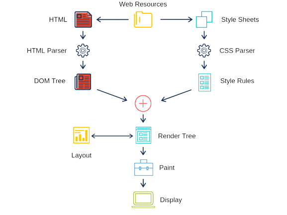

## Exercise1.1: When a user enters an URL in the browser, how does the browser fetch the desiredresult?

The main functionality of a web browser is to retrieve, display and navigate through web pages on the internet. It uses HTTP to request web pages from servers and display them on the user's device. Browsers also allow users to interact with web pages, such as filling out forms and clicking links, and can store information such as cookies to remember user preferences and browsing history. 

A web browser is made up of several high-level components that work together to retrieve, display, and interact with web pages. These components include User Interface, Rendering Engine, Networking, JavaScript Engine, Browser History, Security, Developer Tools, Data Management.

When a user enters a URL into a browser, the browser first sends a request to a DNS server to resolve the domain name in the URL to an IP address. The browser then sends an HTTP request to the web server specified by the IP address. The web server responds by sending the HTML of the webpage to the browser.

When a web browser receives a web page, it uses its built-in parsers to interpret and process the code of the page. One important step in this process is the construction of a DOM tree. These parsers include HTML parsers, which interpret the structure and content of web pages written in HTML, CSS parsers, which interpret and apply the styles defined in CSS to the web page. Web browsers also include built-in script processors that interpret and execute JavaScript code embedded in web pages. 

When a web browser loads a web page, it processes the scripts in a specific order to ensure that the web page behaves as intended. The general order of script processing is HTML parsing then CSS parsing then JavaScript parsing then JavaScript execution then Painting.

